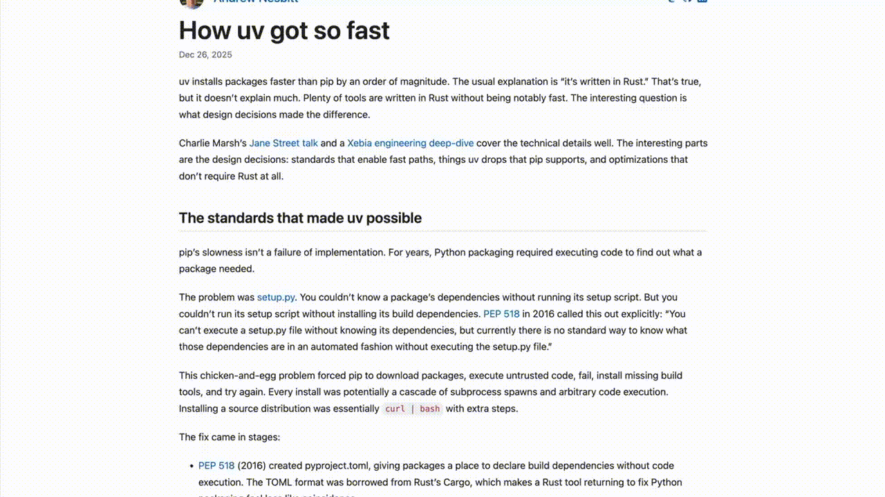

# Parsely

Read articles one paragraph at a time with focused, distraction-free reading.

<p align="center">
  <a href="https://chromewebstore.google.com/detail/parsely/ackaeneemjkgbjpbmpogdbkpkfeobamj">
    
  </a>
</p>

<p align="center">
  <a href="https://chromewebstore.google.com/detail/parsely/ackaeneemjkgbjpbmpogdbkpkfeobamj">
    <strong>Install for Chrome</strong>
  </a>
</p>

## Demo

<p align="center">
  
</p>

## Features

- **Paragraph-by-paragraph reading** - Focus on one paragraph at a time
- **Distraction-free mode** - Clean reading interface without clutter
- **Reading progress** - Track your position in long articles
- **Keyboard shortcuts** - Navigate with arrow keys or spacebar
- **Works offline** - No account required, no data sent to servers

## Development

### Prerequisites

- Node.js 18+
- npm or pnpm

### Setup

```bash
# Install dependencies
npm install

# Start development server (Chrome)
npm run dev

# Start development server (Firefox)
npm run dev:firefox
```

### Build

```bash
# Build for Chrome
npm run build

# Build for Firefox
npm run build:firefox

# Create zip for store submission
npm run zip
npm run zip:firefox
```

### Testing

```bash
# Run tests
npm test

# Run tests with coverage
npm run test:coverage
```

## Project Structure

```
src/
├── core/           # Core parsing and reading logic
├── components/     # UI components
├── features/       # Feature modules (analytics, etc.)
├── entrypoints/    # Extension entry points (popup, content scripts)
└── utils/          # Shared utilities
```

## Tech Stack

- [WXT](https://wxt.dev/) - Next-gen web extension framework
- [TypeScript](https://www.typescriptlang.org/)
- [Vite](https://vitejs.dev/)
- [@mozilla/readability](https://github.com/mozilla/readability) - Article extraction

## Contributing

Contributions are welcome! Please feel free to submit a Pull Request.

## License

[MIT](LICENSE)
